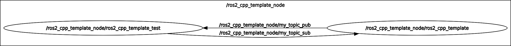

# ROS2 C++ Node Template

ROS 2 Humble C++ project template, with:
- Parameters
- Launch file
- Subscribers and publishers
- Services and clients
- Google GTest
- Benchmark

An example with custom msg and srv is available in this [ROS2 C++ Node Example](https://github.com/RPS98/ros2_cpp_node_example)

## Test the node:

Launch the node with:
```
ros2 launch ros2_cpp_template ros2_cpp_template_launch.py 
```

Launch test part:
```
ros2 launch ros2_cpp_template ros2_cpp_template_launch.py config_file:=./config/config_file_test.yaml name:=ros2_cpp_template_test
```

RQT Graph Image of testing:

